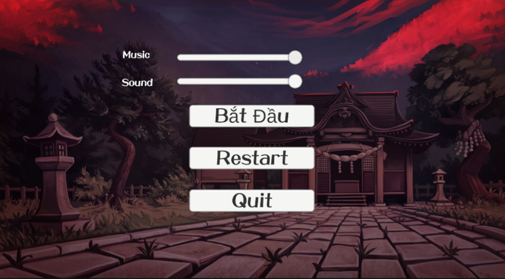
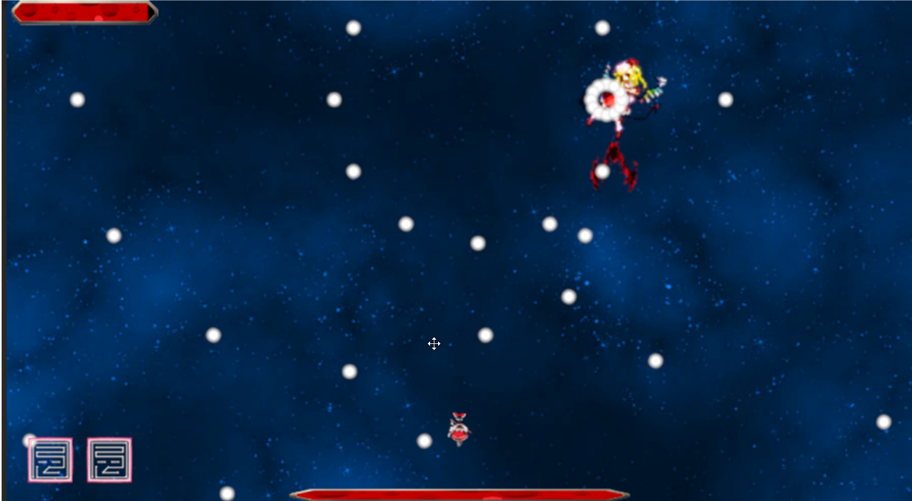
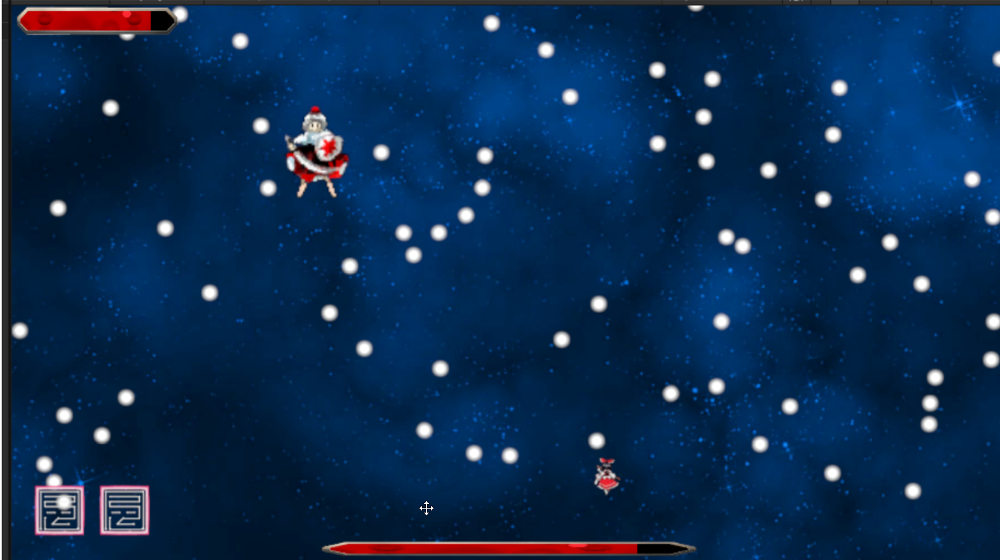
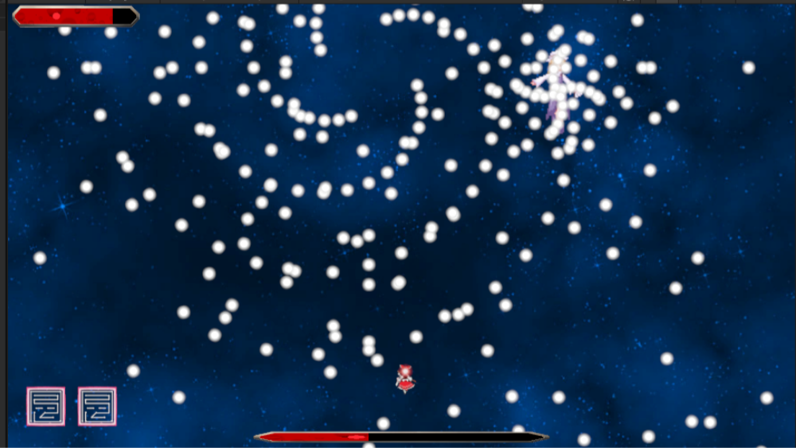
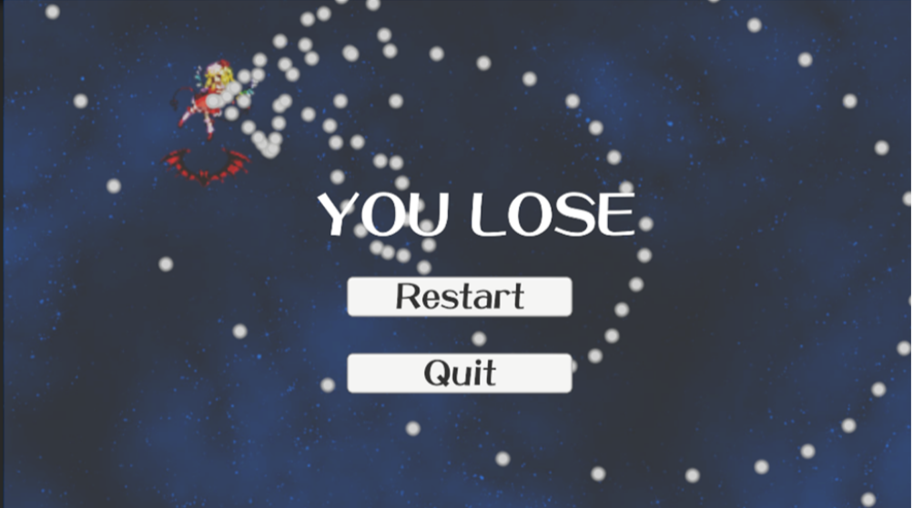
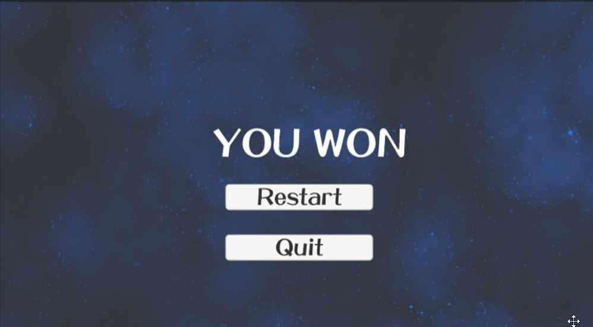

# **Touhou 16 remaster**

Một fan game Touhou thể loại "bullet hell" (danmaku) 2D được phát triển trên nền tảng Unity. Người chơi sẽ điều khiển nhân vật Hakurei Reimu chiến đấu chống lại các Boss với những loạt đạn đầy thử thách.

### **MỤC LỤC**

* [Tên Game](https://www.google.com/search?q=%23t%C3%AAn-game)  
* [Thể Loại](https://www.google.com/search?q=%23th%E1%BB%83-lo%E1%BA%A1i)  
* [Cách Chơi & Điều Khiển](https://www.google.com/search?q=%23c%C3%A1ch-ch%C6%A1i--%C4%91i%E1%BB%81u-khi%E1%BB%83n)  
* [Screenshots](https://www.google.com/search?q=%23screenshots)  
* [Tính Năng Nổi Bật](https://www.google.com/search?q=%23t%C3%ADnh-n%C4%83ng-n%E1%BB%95i-b%E1%BA%ADt)  
* [Cài Đặt & Chạy Thử](https://www.google.com/search?q=%23c%C3%A0i-%C4%91%E1%BA%B7t--ch%E1%BA%A1y-th%E1%BB%AD)  
* [Điểm Nhấn Về Kỹ Thuật](https://www.google.com/search?q=%23%C4%91i%E1%BB%83m-nh%E1%BA%A5n-v%E1%BB%81-k%E1%BB%B9-thu%E1%BA%ADt)  
* [Lộ Trình Phát Triển](https://www.google.com/search?q=%23l%E1%BB%99-tr%C3%ACnh-ph%C3%A1t-tri%E1%BB%83n)

## **Tên Game**

* Touhou 16 remaster

## **Thể Loại**

* Bullet Hell (Danmaku)  
* 2D Top-down Shooter  
* Fan game Touhou Project

## **Cách Chơi & Điều Khiển 🎮**

Bạn sẽ vào vai Hakurei Reimu, sử dụng các kỹ năng và đòn tấn công để sống sót qua những cơn mưa đạn và đánh bại Boss.

| Phím | Hành Động |
| :---- | :---- |
| **W, A, S, D** | Di chuyển nhân vật |
| **Chuột Trái** | Bắn đạn |
| **Phím Space** | Lướt (Dash) \- Mở khóa ở Cấp 3 |
| **Phím E** | Bất tử (3 giây) \- Mở khóa ở Cấp 9 |
| **Giữ Chuột Phải** | Xóa đạn trong vùng chọn *(Đang phát triển)* |
| **Phím ESC** | Tạm dừng game |

## **Screenshots 🖼️**

* **Menu Chính**

**{width="4.54586832895888in"
height="2.78125in"}
**

* **Gameplay Level 1**

**{width="4.54586832895888in"
height="2.78125in"}**

* **Gameplay Level 2**

**{width="4.54586832895888in"
height="2.78125in"}**

* **Gameplay Level 3**

**{width="4.54586832895888in"
height="2.78125in"}**

* **Màn hình Game Over / Victory**

**{width="4.54586832895888in"
height="2.78125in"}**  
**{width="4.54586832895888in"
height="2.78125in"}**

## **Tính Năng Nổi Bật ✨**

* **Hệ thống Kỹ năng Thăng cấp:** Nhân vật Reimu sẽ mở khóa các kỹ năng mới khi đạt đến các cấp độ nhất định.  
* **Framework Boss Linh hoạt:** Dễ dàng tạo và tùy chỉnh các màn đấu Boss với những kiểu tấn công (moveset) đa dạng mà không cần viết lại code.  
* **Các Dạng Đạn Thử thách:** Trải nghiệm gameplay danmaku thực thụ với các loại đạn có quỹ đạo phức tạp như đạn vòng cung, đạn nảy, và đạn rơi tự do.  
* **Tối ưu hóa Hiệu năng:** Sử dụng kỹ thuật Object Pooling để đảm bảo game chạy mượt mà ngay cả khi có hàng trăm viên đạn trên màn hình.  
* **Giao diện Tối giản:** UI được thiết kế thân thiện, giúp người chơi tập trung hoàn toàn vào gameplay.

## **Cài Đặt & Chạy Thử 🚀**

Bạn có thể trải nghiệm game hoặc tham gia phát triển dự án theo các hướng dẫn dưới đây.

### **Để Chơi Game**

Cách dễ nhất để chơi là tải bản build hoàn chỉnh của game.

1. Truy cập vào mục [**Releases**](https://www.google.com/search?q=https://github.com/%5BT%C3%AAn-user-c%E1%BB%A7a-b%E1%BA%A1n%5D/%5BT%C3%AAn-repo-c%E1%BB%A7a-b%E1%BA%A1n%5D/releases) của repo này.  
2. Tải về file setup mới nhất cho hệ điều hành của bạn.  
3. Chạy file .exe để bắt đầu cài đặt game và chơi.

### **Dành Cho Lập Trình Viên**

Nếu bạn muốn xem mã nguồn hoặc đóng góp cho dự án, bạn cần cài đặt Unity.

1. Cài đặt [Unity Hub](https://unity.com/download) và phiên bản **Unity 6000.3.0a3** .  
2. Clone repo này về máy của bạn:  
   git clone https://github.com/Scove-Metalreal/Touhou.git  
3. Mở Unity Hub, chọn "Add project" và trỏ đến thư mục bạn vừa clone.  
4. Mở dự án và nhấn nút **Play** trong Unity Editor.

## **Điểm Nhấn Về Kỹ Thuật 🛠️**

* **Framework Boss dùng Scriptable Objects:** Mỗi kiểu tấn công của Boss được định nghĩa trong một Scriptable Object riêng. Điều này cho phép thiết kế các màn đấu Boss bằng cách kéo-thả các "kịch bản" tấn công vào trong Inspector của Unity, giúp quá trình phát triển cực kỳ nhanh chóng và linh hoạt.  
* **Object Pooling:** Xây dựng một hệ thống quản lý "bể chứa" (pool) cho các đối tượng hay được tạo/hủy liên tục (như đạn, hiệu ứng nổ). Kỹ thuật này giúp giảm đáng kể việc cấp phát bộ nhớ và gánh nặng cho CPU, đảm bảo hiệu năng ổn định.

## **Lộ Trình Phát Triển 🗺️**

Dự án vẫn đang trong quá trình hoàn thiện với các kế hoạch trong tương lai:

* \[ \] Hoàn thiện kỹ năng **Xóa Đạn Vùng** và **Spell Card**.  
* \[ \] Thêm các loại kẻ địch thường (minions).  
* \[ \] Thiết kế thêm Boss và các AttackPattern mới.  
* \[ \] Tích hợp hệ thống âm thanh (nhạc nền và SFX).  
* \[ \] Nâng cấp đồ họa và hiệu ứng hình ảnh (VFX).

